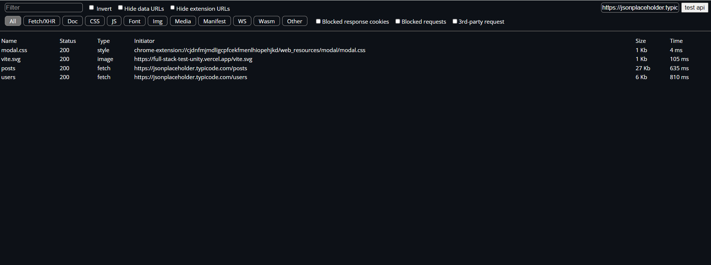
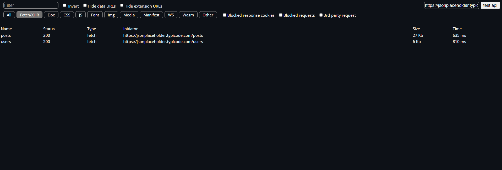
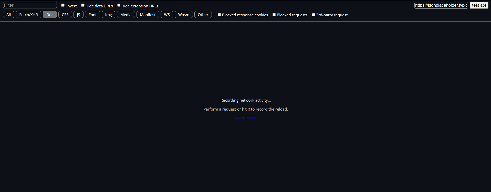

# DevTools Replica Project

The DevTools Replica Project is an innovative endeavor designed to recreate the core functionalities of Google Chrome's Developer Tools.

## Important Links

- [Deployed Link](https://full-stack-test-unity.vercel.app/)

- [Repo Link](https://github.com/artisonii/fullStack_testUnity)

- [Demo Link](https://drive.google.com/file/d/1te8ribri39h2eqNSc5MR4GY87A5xxJGs/view?usp=sharing)

### Key Features

1. **Request Monitoring**: The application provides a comprehensive list of all network requests made by a web page, similar to the Network tab in Chrome DevTools. This feature helps developers monitor and analyze the traffic between their application and the server.

2. **Request Details**: For each network request, detailed information is displayed, including response,starus and timing. This granularity allows developers to debug and optimize their network interactions effectively.

3. **Filtering**: The tool includes powerful filtering options, enabling developers to sort network requests by type (e.g., XHR, JS, CSS). This functionality aids in isolating specific types of requests for closer inspection.

### Technical Implementation

- **ReactJS**: The project is built using ReactJS, a popular JavaScript library for building user interfaces. React's component-based architecture ensures a modular and maintainable codebase.

- **Redux**: Redux is employed for state management, providing a predictable state container that helps manage the application's state efficiently. This choice ensures that the state is handled in a scalable and maintainable way, even as the application grows in complexity.

## Functional Requirements

1. **Request Monitoring**: List all network requests made by the page.
2. **Request Details**: Show detailed information about each request (name, status, type, size, timing).
3. **Filtering**: Allow filtering of network requests by type (XHR, JS, CSS, etc.).

## Technical Requirements

1. **Framework**: Used ReactJS framework.

2. **State Management**: Implemented state management using Redux.

## Screenshots

 
 
 

 
 

# Created by Arti Soni

- [LinkedIn](https://www.linkedin.com/in/arti-soni/)
- [Portfolio](https://artisonii.github.io/)
- [GitHub](https://github.com/artisonii)
